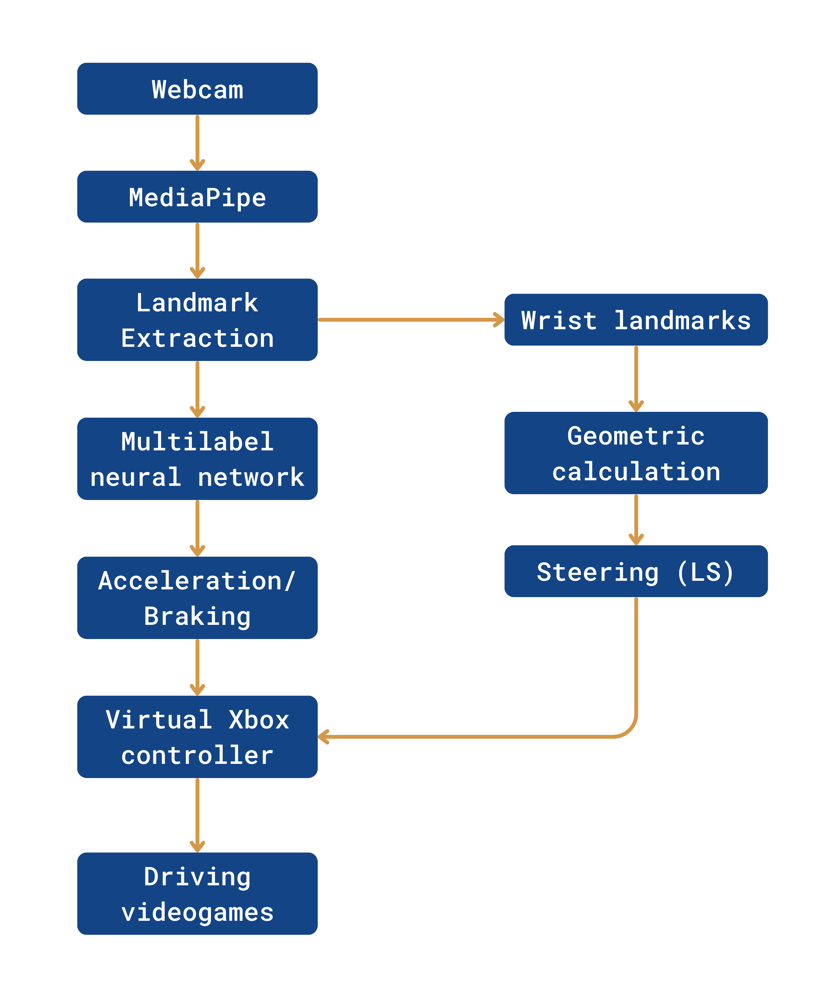

# Gesture-Based Control for Driving Simulators Using Computer Vision

A real-time hand gesture recognition system that allows users to control driving simulators using only a webcam. The project combines Computer Vision, MediaPipe Hands, Deep Learning, and Xbox Controller Emulation to provide an alternative and immersive way to interact with racing games such as Dirt Rally.

## Overview

Traditional driving simulators require physical devices such as keyboards, gamepads, or steering wheels. While these peripherals provide precise control, they can be expensive or inaccessible for some users. This project proposes a vision-based gesture control system capable of: 

- Steering the vehicle using hand movements.
- Accelerating with the right thumb gesture.
- Braking with the left thumb gesture.
- Simultaneously accelerating and braking using both thumbs.
- Emulating a virtual Xbox controller compatible with commercial racing games.

The entire system works using only a conventional webcam.

## Features
- Real-time hand trackikng using MediaPipe Hands
- Deep Learning-based gesture recognition
- Multilabel classification
- Steering Wheel simulation bases on wrist orientation
- Virtual Xbox controller integration using ViGemBus
- Compatible with racing simulators such as Dirt Rally

## System Architecture

The system follows the pipeline below:

## Technologies Used
-  Python
- OpenCV
- MediaPipe
- TensorFlow / Keras
- NumPy
- vgamepad
- ViGEmBus Driver

## Installation

Clone Repository

### Install Dependencies
pip install -r requirements.txt

### Install ViGEmBus
Download and install:
https://github.com/nefarius/ViGEmBus/releases

## Running the System
python IntegratedModel.py

### Controls:
Q -> Exit aplication

### Gestures:
- Right Thumb up -> Accelerate
- Left Thumb up -> Brake
- Steering

## Results

The trained model achieved:
- High classification accuracy
- Low false positive rate
- Real-time inference performance
- Stable steering estimation

The system successfully controls the videogame Dirt Rally, Trackmania, using only hand gestures captured through a webcam

## Authors
- Daniel Torres
- Natalia Muñoz
- Juan Plata

Multimedia Engineers

Computer Vision • Artificial Intelligence • Game Development
